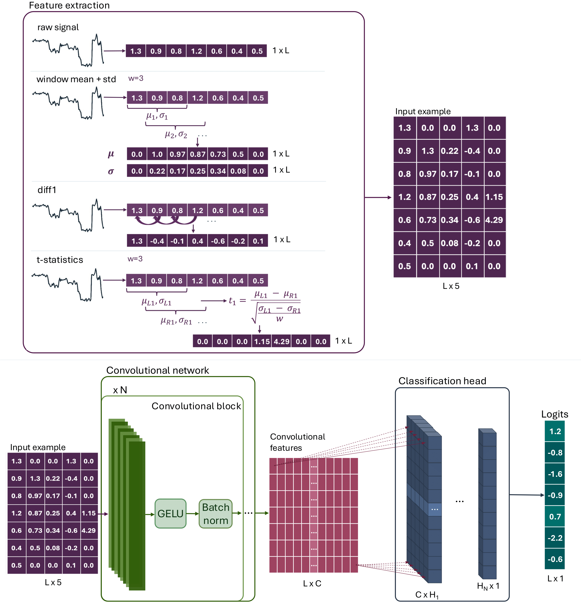

# CAMPOLINA

### [Weights](https://zenodo.org/records/15626806)

[Sara Bakić](https://scholar.google.com/citations?user=xypMKj8AAAAJ&hl=en)<sup>1,2</sup>,
[Krešimir Friganović](https://scholar.google.hr/citations?user=0KOB_YkAAAAJ&hl=en)<sup>1</sup>,
[Bryan Hooi](https://www.comp.nus.edu.sg/cs/people/bhooi/)<sup>1</sup>,
[Mile Šikić](https://www.a-star.edu.sg/gis/our-people/faculty-staff/members/mile-sikic)<sup>1,3</sup>
<br>
<sup>1</sup>Genome Institute of Singapore (GIS), Agency for Science, Technology and Research (A\*STAR), Singapore <br>
<sup>2</sup>School of Computing (SOC), National University of Singapore, Singapore <br>
<sup>3</sup>Faculty of Electrical Engineering and Computing, University of Zagreb, Croatia

This is the official implementation of the paper "Campolina: A Deep Neural Framework for Accurate Segmentation of Nanopore Signals".

## About
Nanopore sequencing provides real-time, long-read sequencing, enabling the direct analysis of nucleic acids. The real-time methods allow parallel execution of sequencing and analysis by processing raw nanopore signals, the immediate product of nanopore sequencing, at the same rate as they are produced. The core step of real-time frameworks, segmentation of raw nanopore signals into events corresponding to individual nucleotide translocations, is traditionally done with an algorithmic approach, which is insufficiently robust in noisy regions of the signal. We propose Campolina, a first deep-learning framework for accurate segmentation of raw nanopore signals. Campolina is a convolution-based model trained to identify event borders in raw nanopore signals. We extensively compare Campolina with the traditional Scrappie algorithm on R9.4.1 and R10.4.1 datasets. To evaluate the quality of the segmentation, we develop an evaluation pipeline that quantifies how well the obtained events match the ground truth and the corresponding reference. Additionally, we test Campolina as a segmentation strategy in the existing real-time frameworks, Sigmoni and RawHash2. Campolina significantly enhances the quality of segmentation compared with the algorithmic approach, and improves the performance of real-time frameworks, all while maintaining time efficiency, thereby increasing the potential of effective real-time analyses.
 

## Quick Start - Inference
Use following commands for the installation (Prerequisites: ```Python>=3.8``` and ```CUDA>=11.8```):
```bash
git clone https://github.com/lbcb-sci/Campolina
cd Campolina
pip install .
```

## Installation
1. Clone the repo.
```bash
git clone https://github.com/lbcb-sci/Campolina
cd Campolina
```
2. Create conda environment. All external dependencies should be contained in ```environment.yml```.
```bash
# create conda environment for RiNALMo
conda env create -f environment.yml

# activate RiNALMo environment
conda activate campolina
```
3. Download pre-trained weights.
```bash
mkdir weights
cd weights
wget https://zenodo.org/records/15626806/files/R10_model.pth # model trained for R10.4.1 nanopore version
wget https://zenodo.org/records/15626806/files/R10_model.pth # model trained for R9.4.1 nanopore version
```   

## Usage
We provide pre-trained Campolina models for R10.4.1 and R9.4.1 nanopore version. Both mdoels follow the same architecture design and can be used for predicting event borders from raw nanopore signals using ```inference.py``` script. The details of running the inference can be checked with ```--help```.

### Evaluation
Within the scope of this paper, we develop an extensive pipeline for assessing the quality of the obtained segmentation. The assessment of the segmentation quality can be with the following steps:
1. Extract ground-truth.
```bash 
bash extract_ground_truth.sh
```
2. Align predicted events to the ground truth events with detailed usage explanation available through ```--help```.
```bash
python align_events.py
```
3. Quantify the quality of the segmentation with detailed usage explanation available throug ```--help```.
```bash
pyton assess_segmentation_quality.py
```
#### Example
To evaluate the fine-tuned RiNALMo model and prediction head on archiveII 5S rRNA test dataset for secondary structure prediction, use the ```rinalmo_giga_ss_archiveII-5s_ft.pt``` weights. Here, we provide an example run command.
```
python train_sec_struct_prediction.py ./ss_data --test_only --init_params ./weights/rinalmo_giga_ss_archiveII-5s_ft.pt --dataset archiveII_5s --prepare_data --output_dir ./outputs/archiveII/5s/ --accelerator gpu --devices 1
```

## Contact
If you have any questions, please feel free to email the authors or open an issue.

## Acknowledgment
This research is supported by the Singapore Ministry of Health’s National Medical Research Council under its Open Fund – Individual Research Grants (NMRC/OFIRG/MOH-000649-00).
